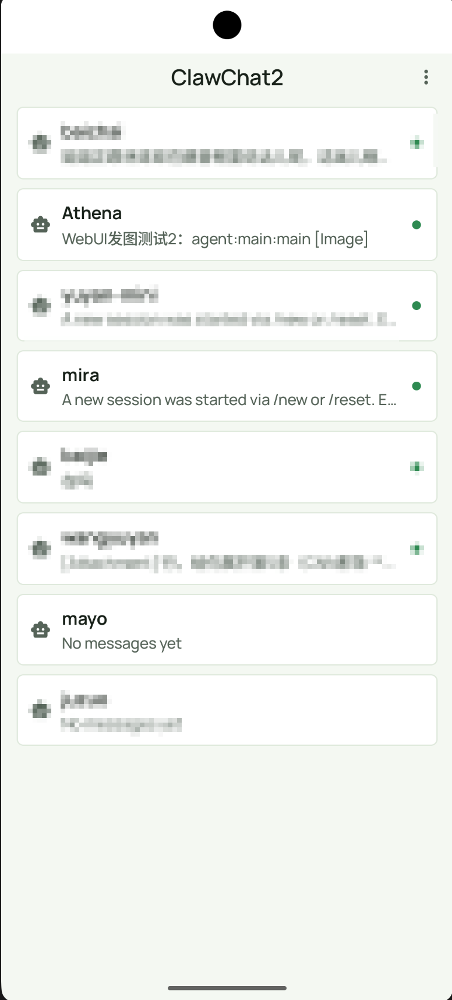
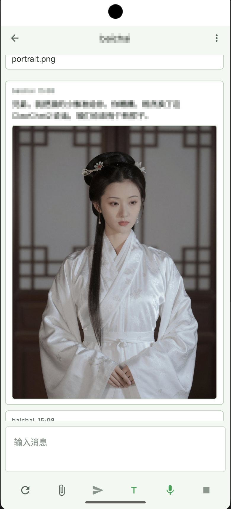

# ClawChat2

## English

ClawChat2 is an unofficial Android fork derived from the official OpenClaw Android client in `openclaw/openclaw -> apps/android`.

This fork focuses on one product goal: a simple, direct, chat-first way to talk with OpenClaw agents from Android, with stronger media receive/render support for image, audio, and video messages.

The short rationale for the fork is documented in [WHY_THIS_FORK.md](WHY_THIS_FORK.md).

### Project Status

- Baseline version: `0.2.3`
- Android compatibility baseline: `minSdk 30` (Android 11+)
- Stage: early, experimental, not release-hardened
- Scope: independent community fork, not an official OpenClaw distribution

### Fork Positioning

Compared with the upstream Android client, this fork currently emphasizes:

- chat as the primary surface
- direct agent conversations
- `openclaw-webchat` as the source of truth for contacts and chat history
- simplified chat-first navigation
- selectable app theme mode with dark-mode support
- WeChat-style continuous contacts list with larger avatars and lighter separators
- continuous chat-message presentation with simplified spacing-first styling and synced user display name
- enhanced agent-to-client media handling
- practical Android playback stability improvements for fullscreen image/video viewing
- streamed fullscreen video playback for large remote files
- practical gateway access patterns including Tailscale-friendly usage

This repository explores a narrower Android UX for users who mainly want to open the app and chat with their OpenClaw agents directly, without extra shell complexity, unnecessary setup, or registration overhead beyond what is required to connect to their own OpenClaw gateway.

### Important Notice

- This repository is based on code from the official OpenClaw project.
- It is not published by, affiliated with, or endorsed by the OpenClaw maintainers.
- Upstream references are included only to document code origin and compatibility targets.
- Original upstream license and attribution are preserved in [LICENSE](LICENSE), [FORK_NOTES.md](FORK_NOTES.md), and [THIRD_PARTY_LICENSES](THIRD_PARTY_LICENSES).

Related docs:

- [CONTRIBUTING.md](CONTRIBUTING.md)
- [OPENCLAW_AGENT_SETUP.md](OPENCLAW_AGENT_SETUP.md)
- [PUBLIC_RELEASE_CHECKLIST.md](PUBLIC_RELEASE_CHECKLIST.md)
- [RELEASING.md](RELEASING.md)
- [RELEASE_NOTES_v0.2.3.md](RELEASE_NOTES_v0.2.3.md)
- [WHY_THIS_FORK.md](WHY_THIS_FORK.md)

### Screenshots

Chat list:



Chat view with media:



### OpenClaw-Side Setup

If you want an OpenClaw-side agent or operator to prepare a gateway specifically for ClawChat2, start with [OPENCLAW_AGENT_SETUP.md](OPENCLAW_AGENT_SETUP.md).

Important:

- setup code is the preferred path
- for manual or Tailscale setup, the user should also fill in the gateway token
- without that token, the device may not appear in `openclaw devices list` when approval is required
- if OpenClaw uses `gateway.tailscale.mode=serve`, setup-code/QR routes are typically `wss://<magicdns>` on port `443`
- on Android, the Tailscale app must be actually connected; "installed and logged in" is not enough

### Media Support

ClawChat2 currently supports structured agent-sent media attachments:

- image receive and fullscreen viewing
- audio receive and playback
- video receive, preview, and fullscreen playback
- streamed remote video playback without requiring a full pre-download

Current local media contract in this fork prefers gateway-relative fields:

```json
[
  { "type": "text", "text": "Optional caption" },
  {
    "type": "image|audio|video",
    "mimeType": "real MIME type",
    "fileName": "original file name",
    "mediaPath": "/media/<token>",
    "mediaPort": 39393,
    "mediaUrl": "http://10.0.2.2:39393/media/<token>",
    "mediaSha256": "<sha256>",
    "sizeBytes": 123456
  }
]
```

Notes:

- `mediaPath` + `mediaPort` are the preferred fields in this fork
- `mediaUrl` is retained as a compatibility fallback
- the current user-originated picker flow is still image-only; audio/video support in this fork is focused on agent-to-client delivery
- fullscreen video playback now prefers streamed playback via Android Media3/ExoPlayer, with local-file fallback only when needed

Operational guides:

- [AGENT_MEDIA_SEND.md](AGENT_MEDIA_SEND.md)
- [AGENT_MEDIA_SERVER.md](AGENT_MEDIA_SERVER.md)

### Build

```bash
./gradlew :app:assembleDebug
./gradlew :app:compileDebugKotlin
./gradlew :app:testDebugUnitTest
```

Install and launch:

```bash
./gradlew :app:installDebug
adb shell am start -n ai.openclaw.app/.MainActivity
```

Current local verification:

- the current `main` workspace was compiled, installed, and launched successfully on the local Android 15 emulator `clawchat2_api35` on 2026-03-24

### Releases

- Public end users should install APKs from GitHub Releases instead of building from source.
- Early public builds should be marked as `Pre-release`.
- Public APKs should be signed with the fork maintainer's own release key.
- Release notes should clearly state that this is an unofficial OpenClaw fork.

Current release guidance is documented in [RELEASING.md](RELEASING.md) and [RELEASE_NOTES_v0.2.3.md](RELEASE_NOTES_v0.2.3.md).

### Development Notes

- Treat this repository as an early-stage fork, not a drop-in upstream replacement.
- Keep fork-specific behavior clearly separated from changes that could plausibly go upstream later.
- Do not add personal endpoints, private tokens, machine-specific paths, or test-only defaults to committed code.
- Use [status.md](status.md) as the public project status summary for this fork.

## 中文

ClawChat2 是一个基于官方 OpenClaw Android 客户端 `openclaw/openclaw -> apps/android` 派生出来的非官方 Android 分叉项目。

这个分叉主要围绕一个产品目标展开：在 Android 上以更简单、更直接、聊天优先的方式与 OpenClaw 的 agent 对话，同时增强图片、音频、视频消息的接收与渲染能力。

关于为什么要做这个分叉的简要说明见 [WHY_THIS_FORK.md](WHY_THIS_FORK.md)。

### 项目状态

- 当前基线版本：`0.2.3`
- Android 兼容基线：`minSdk 30`（Android 11+）
- 当前阶段：早期、实验性、尚未达到发布级稳定
- 项目定位：独立社区分叉，不是官方 OpenClaw 发布版本

### 分叉定位

相较于上游 Android 客户端，这个分叉当前更强调：

- 聊天是主界面与主入口
- 与 agent 的直接对话
- 更简化、聊天优先的导航方式
- 支持可切换的应用主题模式与深色模式
- 更强的 agent 到客户端媒体处理能力
- 更稳定的 Android 图片/视频全屏播放体验
- 更贴近实际使用的网关接入方式，包括对 Tailscale 场景的友好支持

这个仓库的目的，是为那些主要诉求就是“打开 app 直接和自己的 OpenClaw agent 聊天”的用户，探索一种更窄、更直接的 Android 交互方式，尽量减少额外壳层、繁琐设置和不必要的注册/引导负担。

### 重要说明

- 本仓库基于官方 OpenClaw 项目的代码演化而来。
- 本仓库不是官方 OpenClaw 仓库，也不代表 OpenClaw 官方立场。
- 文档中提及上游项目，仅用于说明代码来源与兼容目标。
- 上游许可证与归属说明保留在 [LICENSE](LICENSE)、[FORK_NOTES.md](FORK_NOTES.md) 和 [THIRD_PARTY_LICENSES](THIRD_PARTY_LICENSES) 中。

相关文档：

- [CONTRIBUTING.md](CONTRIBUTING.md)
- [OPENCLAW_AGENT_SETUP.md](OPENCLAW_AGENT_SETUP.md)
- [PUBLIC_RELEASE_CHECKLIST.md](PUBLIC_RELEASE_CHECKLIST.md)
- [RELEASING.md](RELEASING.md)
- [RELEASE_NOTES_v0.2.3.md](RELEASE_NOTES_v0.2.3.md)
- [WHY_THIS_FORK.md](WHY_THIS_FORK.md)

### 截图

聊天列表：


聊天页与媒体展示：


### OpenClaw 侧准备

如果你希望让 OpenClaw 侧的 agent 或操作者为 ClawChat2 准备 gateway，请从 [OPENCLAW_AGENT_SETUP.md](OPENCLAW_AGENT_SETUP.md) 开始。

重要说明：

- 首选方式仍然是 setup code
- 如果用户选择手动设置或 Tailscale 设置，也应填写 gateway token
- 没有这个 token 时，设备在需要批准时可能不会出现在 `openclaw devices list` 中

### 媒体支持

ClawChat2 当前支持 agent 发送的结构化媒体消息：

- 图片接收与全屏查看
- 音频接收与播放
- 视频接收、预览与全屏播放

当前分叉中，本地媒体协议优先使用网关相对字段：

```json
[
  { "type": "text", "text": "Optional caption" },
  {
    "type": "image|audio|video",
    "mimeType": "real MIME type",
    "fileName": "original file name",
    "mediaPath": "/media/<token>",
    "mediaPort": 39393,
    "mediaUrl": "http://10.0.2.2:39393/media/<token>",
    "mediaSha256": "<sha256>",
    "sizeBytes": 123456
  }
]
```

说明：

- `mediaPath` + `mediaPort` 是本分叉当前优先使用的字段
- `mediaUrl` 保留作为兼容性 fallback
- 当前用户主动发送仍主要是图片选择；音频/视频增强主要面向 agent 到客户端的接收链路
- 视频全屏当前优先走 Android Media3/ExoPlayer 的流式播放，必要时再回退到本地文件路径

### 构建

```bash
./gradlew :app:assembleDebug
./gradlew :app:compileDebugKotlin
./gradlew :app:testDebugUnitTest
```

安装并启动：

```bash
./gradlew :app:installDebug
adb shell am start -n ai.openclaw.app/.MainActivity
```

当前本地验证结论：

- 当前 `main` 工作区已于 2026-03-24 在本地 Android 15 模拟器 `clawchat2_api35` 上成功编译、安装并启动

操作文档：

- [AGENT_MEDIA_SEND.md](AGENT_MEDIA_SEND.md)
- [AGENT_MEDIA_SERVER.md](AGENT_MEDIA_SERVER.md)

### 构建

```bash
./gradlew :app:assembleDebug
./gradlew :app:compileDebugKotlin
./gradlew :app:testDebugUnitTest
```

安装并启动：

```bash
./gradlew :app:installDebug
adb shell am start -n ai.openclaw.app/.MainActivity
```

### 发行版本

- 面向公开用户时，应优先通过 GitHub Releases 分发 APK，而不是要求用户自行编译源码。
- 首批公开版本建议标记为 `Pre-release`。
- 对外发布的 APK 应使用分叉维护者自己的 release key 签名。
- Release 说明中应明确写明这是非官方 OpenClaw 分叉。

当前发行流程与首版说明见 [RELEASING.md](RELEASING.md) 和 [RELEASE_NOTES_v0.2.3.md](RELEASE_NOTES_v0.2.3.md)。

### 开发说明

- 请把这个仓库视为早期分叉项目，而不是上游的直接替代品。
- 分叉专属行为要和未来可能 upstream 的改动保持清晰边界。
- 不要提交个人 endpoint、私有 token、机器本地路径或测试专用默认值。
- [status.md](status.md) 是这个分叉的公开项目状态摘要。
